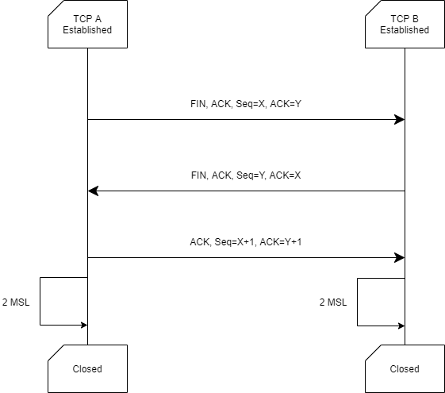

# TCP 协议

以下内容来源于RFC793文档，关于状态处理的详细请见[文档本身](https://www.ietf.org/rfc/rfc793.txt)

## 特性

1. TCP 提供一种面向连接的、可靠的字节流服务
2. 在一个 TCP 连接中，仅有两方进行彼此通信。广播和多播不能用于TCP
4. TCP 给数据分组（segment）编号（seq number），通过累计确认机制（对一个编号为X的包确认意味着X之前的包都已经确认收到）实现可靠连接
4. TCP 使用校验和，重传机制来保证可靠传输
5. 当一个连接建立后，初始序列号（ initial sequence number ISN ）生成器会生成一个新的 32 位的 ISN，该ISN大约4.55小时会发生重复，而规定一个数据分组（segment）的最大寿命时长（ Maximum Segment Lifetime (MSL) ，默认使用 2 分钟）小于一个ISN发生重复的周期4.55小时的，因此，我们认为这个ISN在网络中是唯一的。

## 建立连接/三次握手

在TCP中，发出握手请求的是状态为`Closed`的关闭端，而另一端是监听状态。
如下图所示，`SYN`代表连接请求，`Seq`为数据分组编号

## 关闭连接/四次挥手

关闭连接的四次挥手可以由已经建立连接中的任意一方发起
如下图所示，`FIN`代表关闭请求，在两次由`TCP B`发起的回传当中，传输尚未传输完成的数据分组
在`TCP A`发送最后一个确认请求后等待两个MSL后标志为`Closed`

## 关闭连接/三次挥手

在RFC793文档中有一种描述：

在请求关闭连接的一方发送`FIN`包且没有更多剩余数据传输，则另一方立即返回FIN包，合并四次挥手中的中间两次的情况
如下图所示，双方同时等待两个MSL后标志为`Closed`

## SYN攻击

- 什么是 SYN 攻击（SYN Flood）？

    在三次握手过程中，服务器发送 SYN-ACK 之后，收到客户端的 ACK 之前的 TCP 连接称为半连接(half-open connect)。此时服务器处于 SYN_RCVD 状态。当收到 ACK 后，服务器才能转入 ESTABLISHED 状态.

    SYN 攻击指的是，攻击客户端在短时间内伪造大量不存在的IP地址，向服务器不断地发送SYN包，服务器回复确认包，并等待客户的确认。由于源地址是不存在的，服务器需要不断的重发直至超时，这些伪造的SYN包将长时间占用未连接队列，正常的SYN请求被丢弃，导致目标系统运行缓慢，严重者会引起网络堵塞甚至系统瘫痪。

    SYN 攻击是一种典型的 DoS/DDoS 攻击（分布式拒绝服务）

- 如何检测 SYN 攻击？

    当你在服务器上看到大量的半连接状态时，特别是源IP地址是随机的，基本上可以断定这是一次SYN攻击。在 Linux/Unix 上可以使用系统自带的 netstats 命令来检测 SYN 攻击。

- 如何防御 SYN 攻击？

    SYN攻击不能完全被阻止，通常做法是尽可能的减轻SYN攻击的危害，常见的防御 SYN 攻击的方法有如下几种：

    - 缩短超时（SYN Timeout）时间
    - 增加最大半连接数
    - 过滤网关防护
    - SYN cookies技术